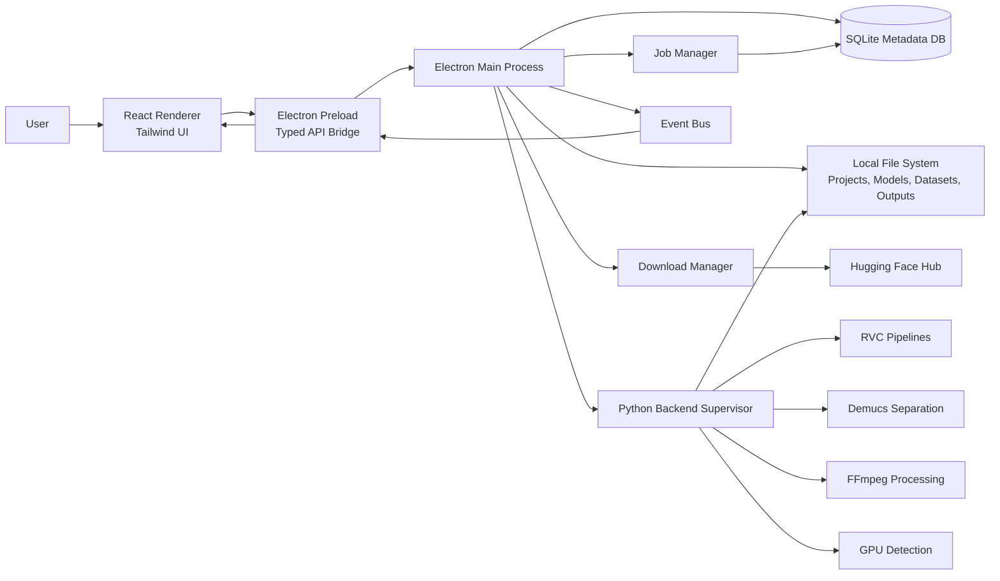
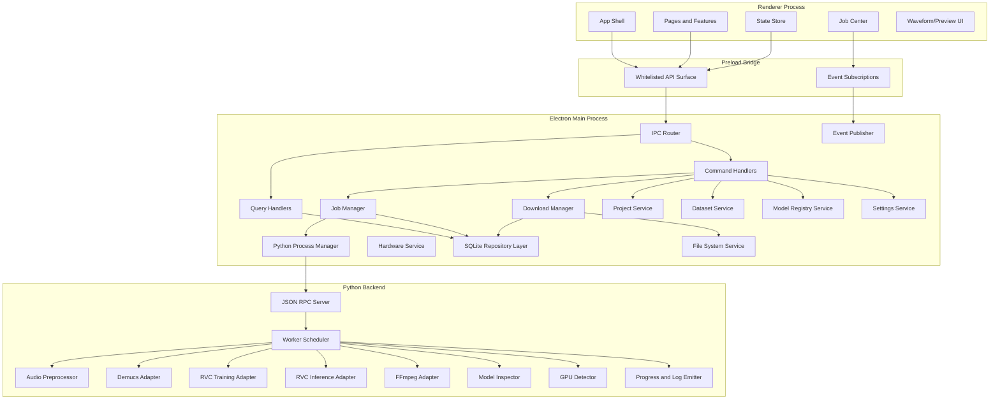
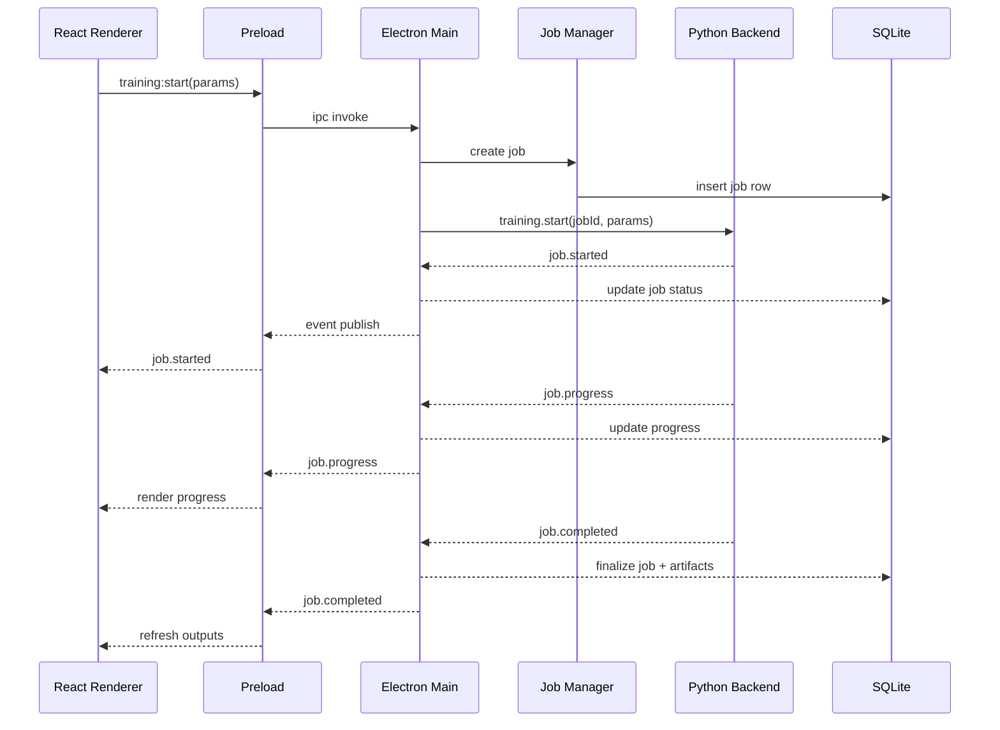
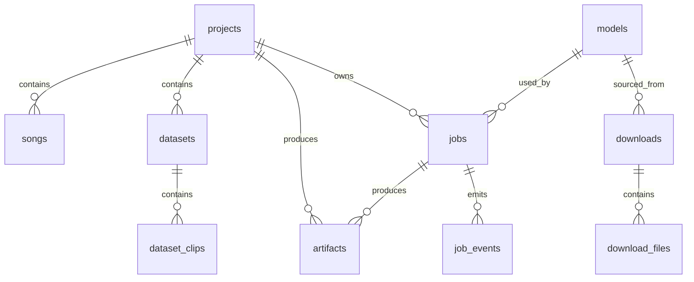

# VoiceAI Studio Architecture

## 1. Overview

VoiceAI Studio is a local-first Windows desktop application for voice AI workflows built on `Electron`, `React`, `Tailwind`, and a local `Python` backend. The architecture is designed for:

- secure Electron-to-Python communication
- long-running background processing
- streaming progress and logs
- resilient local storage
- adapter-based AI pipeline integration for `RVC`, `Demucs`, `FFmpeg`, and `Hugging Face Hub`

The system has no application-owned cloud backend. All project assets, datasets, models, metadata, logs, and generated outputs remain on the user's machine.

## 2. Architecture Principles

- Local-first execution for all AI and media processing
- Secure process isolation between UI and backend
- Job-based orchestration for long-running work
- Typed contracts at every process boundary
- SQLite for metadata, filesystem for large assets
- Recoverable jobs, resumable downloads, persistent logs
- Pluggable AI adapters for model-family-specific behavior

## 3. Runtime Architecture

### 3.1 Process Model

VoiceAI Studio runs as four cooperating layers:

1. `React Renderer`
2. `Electron Preload Bridge`
3. `Electron Main Process`
4. `Python Backend Supervisor + Workers`

The `Electron Main Process` is the orchestration core. It owns:

- the application lifecycle
- secure IPC routing
- the local database connection
- job scheduling and state transitions
- Python backend process supervision
- download lifecycle management
- filesystem operations and project structure management

The `Python Backend` owns:

- hardware detection
- audio preprocessing
- Demucs separation
- RVC preprocessing and inference
- RVC model training
- FFmpeg-based muxing, transcoding, and export
- progress, logs, metrics, and output artifact emission

## 4. Architecture Diagram



## 5. Component Diagram



## 6. Core Components

### 6.1 React Renderer

Responsibilities:

- dashboard, project, dataset, model, training, and conversion screens
- waveform previews and job center
- local state management and optimistic UI
- subscription to job and download events
- rendering task progress, logs, and output artifacts

Suggested modules:

- `features/projects`
- `features/datasets`
- `features/models`
- `features/downloads`
- `features/training`
- `features/conversion`
- `features/separation`
- `features/jobs`
- `features/settings`

### 6.2 Electron Preload Bridge

Responsibilities:

- expose only whitelisted APIs to the renderer
- wrap `ipcRenderer.invoke` and `ipcRenderer.on`
- validate subscription lifecycles
- provide a stable typed interface for frontend code

Suggested API groups:

- `window.voiceai.projects`
- `window.voiceai.datasets`
- `window.voiceai.models`
- `window.voiceai.jobs`
- `window.voiceai.downloads`
- `window.voiceai.audio`
- `window.voiceai.system`
- `window.voiceai.settings`

### 6.3 Electron Main Process

Responsibilities:

- single entry point for renderer commands
- command authorization and validation
- database read/write orchestration
- filesystem boundaries and path validation
- spawning and supervising the Python backend
- scheduling background jobs
- streaming event messages back to the renderer

Main internal services:

- `IpcRouter`
- `CommandBus`
- `QueryBus`
- `JobManager`
- `EventBus`
- `PythonProcessManager`
- `DownloadManager`
- `ProjectService`
- `DatasetService`
- `ModelRegistryService`
- `HardwareService`
- `SettingsService`
- `FileSystemService`
- `SqliteRepository`

### 6.4 Python Backend

Responsibilities:

- execute AI and audio pipelines locally
- normalize all tool-specific behavior under a single RPC contract
- emit granular progress, logs, warnings, checkpoints, and artifact metadata
- handle worker concurrency and cancellation safely

Suggested Python modules:

- `rpc.server`
- `jobs.scheduler`
- `jobs.context`
- `hardware.detector`
- `pipelines.demucs`
- `pipelines.rvc_training`
- `pipelines.rvc_inference`
- `pipelines.ffmpeg`
- `models.registry`
- `storage.artifacts`
- `events.emitter`

## 7. AI Pipeline Architecture

### 7.1 RVC Integration

`RVC` is used for:

- dataset preprocessing
- feature extraction
- voice model training
- voice conversion inference

Recommended adapter split:

- `RvcDatasetPreprocessor`
- `RvcTrainingRunner`
- `RvcInferenceRunner`
- `RvcModelInspector`

### 7.2 Demucs Integration

`Demucs` is used for:

- source audio stem separation
- vocal/instrumental extraction

Recommended adapter:

- `DemucsSeparationRunner`

### 7.3 FFmpeg Integration

`FFmpeg` is used for:

- audio format normalization
- sample rate conversion
- trimming and muxing
- gain and alignment processing
- export to target output formats

Recommended adapter:

- `FfmpegAudioRunner`

### 7.4 Hugging Face Hub Integration

`Hugging Face Hub` is used for:

- model metadata fetch
- repo file enumeration
- authenticated model downloads
- download resume support where possible

Recommended split:

- Electron owns download coordination and job persistence
- Python or a Node helper may inspect downloaded model compatibility

Preferred V1:

- model downloads in Electron Main
- model validation in Python

## 8. IPC Strategy

### 8.1 Why IPC-Centric Design

The UI cannot directly call Python safely. `Electron Main` must remain the single orchestration boundary. This centralizes:

- authentication and validation
- path safety
- job persistence
- event fan-out
- crash recovery

### 8.2 Recommended IPC Pattern

Use a mixed IPC model:

- `request/response` for commands and queries from Renderer to Main
- `event streaming` for progress, logs, state changes, and download updates from Main to Renderer
- `JSON RPC over stdin/stdout` between Main and Python for backend execution

### 8.3 Renderer to Main Channels

Use two classes of channels:

- `invoke` channels for transactional requests
- `subscribe` channels for event streams

Examples:

#### Queries
- `projects:list`
- `projects:get`
- `datasets:list`
- `models:list`
- `jobs:list`
- `system:getHardwareInfo`
- `downloads:list`

#### Commands
- `projects:create`
- `projects:update`
- `songs:import`
- `datasets:create`
- `datasets:importClips`
- `models:download`
- `jobs:cancel`
- `jobs:retry`
- `training:start`
- `separation:start`
- `conversion:start`
- `merge:start`

### 8.4 Main to Python Contract

Use newline-delimited JSON messages. Every message should include:

- `id`
- `type`
- `method`
- `timestamp`
- `payload`

Request example:

```json
{
  "id": "req_01JX123",
  "type": "request",
  "method": "training.start",
  "timestamp": "2026-06-12T10:00:00Z",
  "payload": {
    "jobId": "job_train_001",
    "projectId": "proj_001",
    "datasetId": "ds_001",
    "modelType": "rvc",
    "params": {
      "epochs": 200,
      "batchSize": 8,
      "learningRate": 0.0001
    }
  }
}
```

Progress event example:

```json
{
  "id": "evt_01JX124",
  "type": "event",
  "method": "job.progress",
  "timestamp": "2026-06-12T10:05:12Z",
  "payload": {
    "jobId": "job_train_001",
    "stage": "feature_extraction",
    "progress": 32.5,
    "etaSeconds": 840,
    "message": "Extracting features"
  }
}
```

Completion event example:

```json
{
  "id": "evt_01JX125",
  "type": "event",
  "method": "job.completed",
  "timestamp": "2026-06-12T10:42:00Z",
  "payload": {
    "jobId": "job_train_001",
    "artifacts": [
      {
        "kind": "trained_model",
        "path": "C:/Users/user/AppData/Roaming/VoiceAIStudio/models/trained/model_v1.pth"
      }
    ]
  }
}
```

### 8.5 IPC Reliability Rules

- Every command must return immediately with an accepted response or a validation error.
- Long-running work must be represented as a background job.
- No renderer call should wait for pipeline completion.
- Every job-emitting subsystem must use the same event envelope.
- Events should be persisted to DB-backed job state, not held only in memory.

## 9. Event System

### 9.1 Event Model

VoiceAI Studio should use an in-process event bus in Electron Main as the central fan-out mechanism for state changes coming from:

- UI commands
- download manager
- Python backend
- filesystem watchers if needed
- startup health checks

### 9.2 Event Flow



### 9.3 Event Categories

- `job.created`
- `job.started`
- `job.progress`
- `job.stage_changed`
- `job.log`
- `job.warning`
- `job.checkpoint`
- `job.completed`
- `job.failed`
- `job.cancel_requested`
- `job.cancelled`
- `download.created`
- `download.progress`
- `download.completed`
- `download.failed`
- `download.paused`
- `download.resumed`
- `system.hardware_detected`
- `system.backend_ready`
- `system.backend_unhealthy`
- `project.updated`
- `dataset.updated`
- `model.registered`

### 9.4 Standard Event Envelope

All events should share a common shape:

```json
{
  "eventId": "evt_01JX200",
  "eventType": "job.progress",
  "aggregateType": "job",
  "aggregateId": "job_train_001",
  "timestamp": "2026-06-12T10:15:12Z",
  "source": "python.training",
  "payload": {
    "progress": 45.0,
    "stage": "training",
    "message": "Epoch 90 of 200"
  }
}
```

### 9.5 Event Delivery Strategy

- Persist canonical state in SQLite
- Broadcast hot events to renderer subscribers
- Replay current job state by querying DB on page load
- Treat event streaming as a UI convenience, not the sole source of truth

## 10. Long-Running Task Strategy

### 10.1 Job Types

All heavy operations should become jobs:

- model download
- dataset import and preprocessing
- Demucs separation
- RVC training
- RVC inference
- FFmpeg merge/export
- artifact cleanup

### 10.2 Job State Machine

Recommended statuses:

- `queued`
- `preparing`
- `running`
- `paused`
- `cancelling`
- `completed`
- `failed`
- `cancelled`

### 10.3 Job Execution Ownership

- Electron owns job creation, persistence, and cancellation intent
- Python owns compute-stage execution and job progress emission
- Download Manager owns remote file transfer jobs

### 10.4 Concurrency Strategy

Recommended V1 policy:

- one GPU-intensive job at a time
- one training job at a time
- one inference or separation job at a time per GPU worker
- multiple lightweight downloads allowed concurrently with throttling
- FFmpeg export jobs can run in parallel if resources permit

### 10.5 Recovery Strategy

On app restart:

- reload active jobs from SQLite
- mark unknown incomplete jobs as `interrupted`
- offer retry or cleanup
- restore completed outputs and logs
- reattach to resumable downloads where supported

## 11. Database Schema

### 11.1 Design Notes

Use `SQLite` for metadata and operational state. Store only references to files on disk, never raw audio or model weights.

Key goals:

- fast lookup of projects, datasets, models, and jobs
- durability for long-running tasks
- traceability of artifacts
- audit-friendly event history

### 11.2 Entity Relationship Summary



### 11.3 Tables

#### `projects`

```sql
CREATE TABLE projects (
  id TEXT PRIMARY KEY,
  name TEXT NOT NULL,
  slug TEXT NOT NULL UNIQUE,
  root_path TEXT NOT NULL UNIQUE,
  status TEXT NOT NULL DEFAULT 'active',
  description TEXT,
  settings_json TEXT,
  created_at TEXT NOT NULL,
  updated_at TEXT NOT NULL,
  archived_at TEXT
);
```

#### `songs`

```sql
CREATE TABLE songs (
  id TEXT PRIMARY KEY,
  project_id TEXT NOT NULL,
  name TEXT NOT NULL,
  source_path TEXT NOT NULL,
  managed_path TEXT NOT NULL,
  format TEXT NOT NULL,
  duration_seconds REAL,
  sample_rate INTEGER,
  channels INTEGER,
  waveform_path TEXT,
  metadata_json TEXT,
  created_at TEXT NOT NULL,
  updated_at TEXT NOT NULL,
  FOREIGN KEY (project_id) REFERENCES projects(id) ON DELETE CASCADE
);
```

#### `datasets`

```sql
CREATE TABLE datasets (
  id TEXT PRIMARY KEY,
  project_id TEXT NOT NULL,
  name TEXT NOT NULL,
  path TEXT NOT NULL UNIQUE,
  status TEXT NOT NULL DEFAULT 'draft',
  sample_rate INTEGER,
  clip_count INTEGER NOT NULL DEFAULT 0,
  total_duration_seconds REAL NOT NULL DEFAULT 0,
  tags_json TEXT,
  validation_json TEXT,
  created_at TEXT NOT NULL,
  updated_at TEXT NOT NULL,
  FOREIGN KEY (project_id) REFERENCES projects(id) ON DELETE CASCADE
);
```

#### `dataset_clips`

```sql
CREATE TABLE dataset_clips (
  id TEXT PRIMARY KEY,
  dataset_id TEXT NOT NULL,
  file_path TEXT NOT NULL,
  relative_path TEXT,
  duration_seconds REAL,
  sample_rate INTEGER,
  channels INTEGER,
  transcript TEXT,
  speaker_label TEXT,
  quality_score REAL,
  status TEXT NOT NULL DEFAULT 'ready',
  metadata_json TEXT,
  created_at TEXT NOT NULL,
  updated_at TEXT NOT NULL,
  FOREIGN KEY (dataset_id) REFERENCES datasets(id) ON DELETE CASCADE
);
```

#### `models`

```sql
CREATE TABLE models (
  id TEXT PRIMARY KEY,
  name TEXT NOT NULL,
  family TEXT NOT NULL,
  kind TEXT NOT NULL,
  source_type TEXT NOT NULL,
  source_url TEXT,
  huggingface_repo TEXT,
  version TEXT,
  local_path TEXT NOT NULL UNIQUE,
  config_path TEXT,
  index_path TEXT,
  preview_audio_path TEXT,
  license TEXT,
  compatibility_json TEXT,
  metadata_json TEXT,
  status TEXT NOT NULL DEFAULT 'ready',
  created_at TEXT NOT NULL,
  updated_at TEXT NOT NULL
);
```

#### `downloads`

```sql
CREATE TABLE downloads (
  id TEXT PRIMARY KEY,
  model_id TEXT,
  source_type TEXT NOT NULL,
  source_url TEXT NOT NULL,
  repo_id TEXT,
  revision TEXT,
  target_dir TEXT NOT NULL,
  status TEXT NOT NULL,
  bytes_total INTEGER,
  bytes_downloaded INTEGER NOT NULL DEFAULT 0,
  speed_bps REAL,
  checksum TEXT,
  error_message TEXT,
  started_at TEXT,
  completed_at TEXT,
  created_at TEXT NOT NULL,
  updated_at TEXT NOT NULL,
  FOREIGN KEY (model_id) REFERENCES models(id) ON DELETE SET NULL
);
```

#### `download_files`

```sql
CREATE TABLE download_files (
  id TEXT PRIMARY KEY,
  download_id TEXT NOT NULL,
  remote_path TEXT NOT NULL,
  local_path TEXT NOT NULL,
  size_bytes INTEGER,
  checksum TEXT,
  status TEXT NOT NULL,
  created_at TEXT NOT NULL,
  updated_at TEXT NOT NULL,
  FOREIGN KEY (download_id) REFERENCES downloads(id) ON DELETE CASCADE
);
```

#### `jobs`

```sql
CREATE TABLE jobs (
  id TEXT PRIMARY KEY,
  project_id TEXT,
  dataset_id TEXT,
  model_id TEXT,
  song_id TEXT,
  job_type TEXT NOT NULL,
  queue_name TEXT NOT NULL,
  status TEXT NOT NULL,
  stage TEXT,
  priority INTEGER NOT NULL DEFAULT 100,
  progress REAL NOT NULL DEFAULT 0,
  eta_seconds INTEGER,
  params_json TEXT NOT NULL,
  result_json TEXT,
  error_code TEXT,
  error_message TEXT,
  log_path TEXT,
  worker_id TEXT,
  cancel_requested INTEGER NOT NULL DEFAULT 0,
  started_at TEXT,
  completed_at TEXT,
  created_at TEXT NOT NULL,
  updated_at TEXT NOT NULL,
  FOREIGN KEY (project_id) REFERENCES projects(id) ON DELETE SET NULL,
  FOREIGN KEY (dataset_id) REFERENCES datasets(id) ON DELETE SET NULL,
  FOREIGN KEY (model_id) REFERENCES models(id) ON DELETE SET NULL,
  FOREIGN KEY (song_id) REFERENCES songs(id) ON DELETE SET NULL
);
```

#### `job_events`

```sql
CREATE TABLE job_events (
  id TEXT PRIMARY KEY,
  job_id TEXT NOT NULL,
  event_type TEXT NOT NULL,
  source TEXT NOT NULL,
  payload_json TEXT NOT NULL,
  created_at TEXT NOT NULL,
  FOREIGN KEY (job_id) REFERENCES jobs(id) ON DELETE CASCADE
);
```

#### `artifacts`

```sql
CREATE TABLE artifacts (
  id TEXT PRIMARY KEY,
  project_id TEXT,
  job_id TEXT,
  artifact_type TEXT NOT NULL,
  name TEXT NOT NULL,
  path TEXT NOT NULL UNIQUE,
  format TEXT,
  size_bytes INTEGER,
  metadata_json TEXT,
  created_at TEXT NOT NULL,
  FOREIGN KEY (project_id) REFERENCES projects(id) ON DELETE SET NULL,
  FOREIGN KEY (job_id) REFERENCES jobs(id) ON DELETE SET NULL
);
```

#### `system_snapshots`

```sql
CREATE TABLE system_snapshots (
  id TEXT PRIMARY KEY,
  cpu_json TEXT,
  gpu_json TEXT,
  memory_json TEXT,
  storage_json TEXT,
  python_json TEXT,
  cuda_json TEXT,
  created_at TEXT NOT NULL
);
```

#### `settings`

```sql
CREATE TABLE settings (
  key TEXT PRIMARY KEY,
  value_json TEXT NOT NULL,
  updated_at TEXT NOT NULL
);
```

### 11.4 Recommended Indexes

```sql
CREATE INDEX idx_songs_project_id ON songs(project_id);
CREATE INDEX idx_datasets_project_id ON datasets(project_id);
CREATE INDEX idx_dataset_clips_dataset_id ON dataset_clips(dataset_id);
CREATE INDEX idx_models_family_kind ON models(family, kind);
CREATE INDEX idx_downloads_status ON downloads(status);
CREATE INDEX idx_jobs_status_queue ON jobs(status, queue_name);
CREATE INDEX idx_jobs_project_id ON jobs(project_id);
CREATE INDEX idx_jobs_model_id ON jobs(model_id);
CREATE INDEX idx_job_events_job_id_created_at ON job_events(job_id, created_at);
CREATE INDEX idx_artifacts_project_id ON artifacts(project_id);
CREATE INDEX idx_artifacts_job_id ON artifacts(job_id);
```

## 12. Recommended Queue Topology

Recommended logical queues in Electron Main:

- `downloads`
- `preprocessing`
- `separation`
- `training`
- `inference`
- `export`
- `maintenance`

Recommended worker policy:

- training queue bound to exclusive GPU worker
- inference and separation share a constrained GPU worker pool
- export queue uses CPU worker pool
- downloads run in Electron-managed async workers

## 13. Security Boundaries

- Renderer has no direct filesystem or process access
- Preload exposes only explicit APIs
- Electron validates all input paths against allowed roots
- Python runs only approved pipeline commands
- Downloaded model assets are treated as data, not executable code
- Secrets such as Hugging Face tokens should use Windows credential storage when possible

## 14. Recommended Folder Ownership

- Electron Main owns `SQLite`, project metadata, download persistence, and orchestration
- Python owns compute-time temp artifacts, logs, and pipeline outputs until artifact registration
- Shared contracts should live in a common package for channel names, event envelopes, and job payload schemas

## 15. Build Recommendation

### 15.1 Frontend and Desktop

- `React` + `TypeScript`
- `Tailwind CSS`
- `Electron`
- `electron-builder`
- `better-sqlite3`
- `zod`
- `zustand`

### 15.2 Python Backend

- `Python 3.11+`
- `torch`
- `torchaudio`
- `demucs`
- `huggingface_hub`
- `ffmpeg` binary bundled or installed with guided setup

## 16. Implementation Recommendation

### 16.1 Phase 1

- Electron shell, preload API, SQLite, project management
- Python supervisor and JSON RPC channel
- Job manager and event bus
- Hugging Face downloads
- Demucs separation
- FFmpeg merge/export
- basic RVC inference

### 16.2 Phase 2

- dataset validation and preprocessing
- RVC training pipeline
- checkpoint handling
- richer job center and recovery flows

### 16.3 Phase 3

- multi-model compatibility adapters
- batch pipelines
- advanced performance controls
- enhanced artifact lineage and reproducibility

## 17. Final Recommendation

The most stable architecture for VoiceAI Studio is an Electron-orchestrated desktop system where `Electron Main` owns trust boundaries, persistence, and job lifecycle, while `Python` owns all AI and heavy media execution behind a structured RPC protocol. This keeps the UI responsive, makes long-running tasks recoverable, and cleanly supports local model downloads, RVC training, Demucs separation, and FFmpeg-based audio processing.
